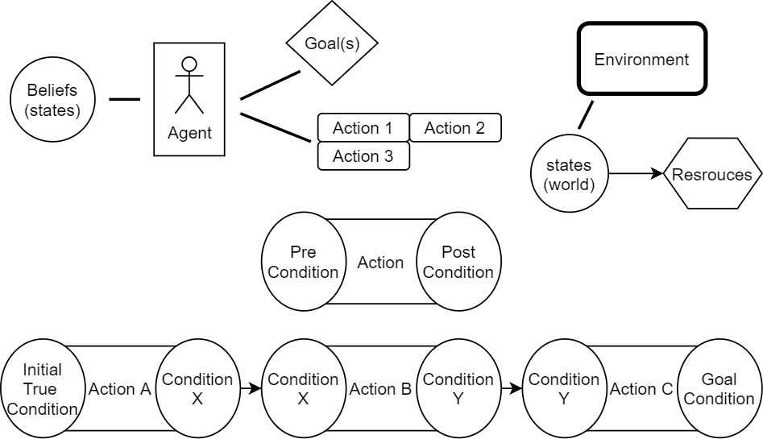

# AI-Simulation-Framework
Simple clinic simulation where where AI-controlled characters perform domain-specific actions to achieve specified goals based on a GOAP planner.

Project Demo videos:
https://drive.google.com/file/d/1I6DOVQXJj9tB7w2Nz4B9UtfQ983EIIhp/view?usp=sharing
https://drive.google.com/file/d/1mbrUxxXE3vJfGRwTZa5eFQqas6dwhYPU/view?usp=sharing

Project Interaction Demo video:
https://drive.google.com/file/d/1VZWBH9ZKHmzPfyxghvnRX48oC1uCHd9D/view?usp=sharing

Issues with project build, uploading comlpete unity project soon.
